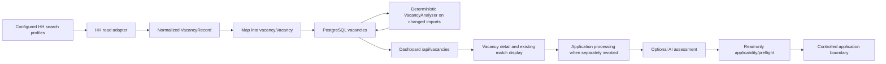

# P1 — Vacancy Discovery & Ranking Baseline

Status: `PASS` for the read-only product audit and design baseline.

This report records the current Vacancy Discovery state, measured against the
configured PostgreSQL runtime on 2026-09-11. It is intentionally a design and
audit artifact. No production ranking logic, schema, prompt, semantic scope,
or HH write path was changed.

## 1. Executive Summary

The repository has a functioning read-only HH discovery and synchronization
pipeline, a deterministic vacancy analyzer, and a typed AI-assisted
application-preparation path. It does not yet provide a trustworthy daily
ranked review queue.

The current PostgreSQL snapshot contains 279 vacancy rows. Only 20 contain a
persisted `match_result`; 259 contain no match result. None has `published_at`
or `hh_updated_at`, and 161 rows have no local `created_at`/`updated_at`.
There is no vacancy-specific durable state for `unseen`, `seen`, `interesting`,
`skip`, `dismissed`, or `reviewed`. Consequently, “new since my last review”
and “never reviewed” cannot be measured safely today.

The current list is sorted by publication time, falling back to descending
vacancy ID when publication times are empty. It exposes search, recommendation,
and score filters, but it is not a ranking layer. The 20 stored match results
are deterministic local analysis, not evidence that 20 durable AI analyses
exist. A separate durable AI-analysis count is not represented by the current
model.

The most important product blockers are:

1. freshness and vacancy review state are absent;
2. the dataset is materially incomplete for ranking (no provider publication
   timestamps, no normalized work format, no persisted key-skills or
   requirements arrays, and 259 unanalyzed rows);
3. discovery configuration can exclude allowed candidate targets before any
   ranking runs, notably through a configured HH salary filter of 60,000 while
   canonical salary preference starts at 40,000–50,000;
4. application/review outcome history is not a vacancy queue state, and
   existing notification state is conversation/reliability state rather than
   vacancy review state.

Recommendation: implement a hybrid, two-stage discovery design eventually:

```text
provider discovery
→ source normalization and identity
→ explicit vacancy freshness/review state
→ deterministic eligibility and explainable base rank
→ bounded AI analysis for top/ambiguous items only
→ ranked review queue
→ explicit user feedback
```

The first implementation stage should be `P1.1 — Vacancy Freshness & Review-
State Foundation`. It should establish durable newness/review semantics and
vacancy fingerprints before changing ranking weights or adding broad AI work.

## 2. Product Goal

The target daily question is:

> Which new vacancies should the candidate review first today, and why?

P1 should turn fetched vacancy records into a candidate-controlled review
queue. Ranking is not authorization. A high-ranked item must never bypass the
existing controlled application chain:

```text
draft → edit → approve → fresh read-only preflight → explicit Send → reconciliation
```

P1 scope is read-only discovery, explanation, and local review feedback. It
does not submit applications, tests, messages, resume changes, job-search
status changes, or any other HH mutation.

## 3. Current Dataset

### Measurement context

The authoritative runtime source is PostgreSQL (`STORAGE_BACKEND=postgres`).
Counts below were obtained with read-only SQL queries against the configured
database. The last recorded vacancy sync is
`2026-09-06T10:05:40.881828Z`; the current audit date is 2026-09-11.

### Cardinality and analysis coverage

| Measure | Current value | Interpretation |
|---|---:|---|
| Vacancy rows | 279 | Canonical PostgreSQL rows |
| Stored `archived=false` | 279 | Local stored state; not a fresh HH availability proof |
| Stored `archived=true` | 0 | No archived rows in this snapshot |
| With persisted `match_result` | 20 | Existing deterministic match output |
| Without persisted `match_result` | 259 | No stored vacancy-level match output |
| With persisted `application_recommendation` | 20 | Same 20 analyzed rows |
| Durable AI-analysis rows | Not represented | No separate vacancy AI-analysis entity/column |
| Exact AI-analysis count | Not measurable | AI assessment is normally ephemeral in application preparation |
| Full `data_completeness` label | 20 | Label is present, but structured fields are not complete in these rows |
| Partial `data_completeness` label | 161 | Mostly recovered description records |
| Minimal `data_completeness` label | 98 | Mostly recovered structured metadata without description |
| Empty `data_completeness` label | 0 | All rows have one of the three labels |

The 20 persisted match results have scores from 47 to 95, average 71.2, and
recommendations of 1 `apply`, 14 `maybe`, and 5 `skip`. Eleven have unknown
skill entries and 19 have risk entries. There are no persisted missing-skill
entries in this snapshot. These results are useful existing evidence, but
they are not a complete ranking population.

### Application and response linkage

| Measure | Current value | Interpretation |
|---|---:|---|
| Applications | 98 | Canonical PostgreSQL application rows |
| Distinct vacancy IDs linked to applications | 98 | Local application history exists for these vacancies |
| Application statuses `applied` | 39 | Local status |
| Application statuses `employer_replied` | 13 | Local status |
| Application statuses `interview` | 11 | Local status |
| Application statuses `rejected` | 35 | Local status |
| Application rows with match result | 0 | Application-level match continuity is absent |
| Conversations | 259 | Canonical PostgreSQL conversation rows |
| Conversations with `application_id` | 0 | Application/conversation relation is not populated |
| Conversations with non-zero vacancy ID | 259 | Vacancy relation exists, but not application relation |

The 98 application-linked vacancies should not be treated as “new” by a future
queue. The vacancy ID relation is durable, but current provider response state
still requires the existing fresh preflight before any real application.

### Vacancy field coverage

| Field or derived fact | Known rows | Unknown/empty rows | Audit consequence |
|---|---:|---:|---|
| `name` | 279 | 0 | Identity display is available |
| `title` | 279 | 0 | Title exists, but does not prove role fit |
| `company_name` | 257 | 22 | Employer grouping is incomplete |
| `description` | 161 | 118 | Deep content is unavailable for 118 rows |
| `requirements` array | 0 non-empty | 279 | No persisted structured requirements |
| `skills` array | 0 non-empty | 279 | No persisted HH key-skill array |
| `area_name` | 98 | 181 | Location gate cannot be applied consistently |
| `location` | 20 | 259 | Detailed location is largely absent |
| `work_format` | 0 | 279 | No normalized office/hybrid/remote field |
| `work_schedule` | 101 | 178 | Raw schedule is available for some rows |
| `work_experience` | 118 | 161 | Mostly available only on recovered/original rows |
| Salary amount (`from` or `to`) | 53 | 226 | Salary is a soft signal for only 53 rows |
| Salary currency | 64 | 215 | Currency is incomplete |
| `response_letter_required=true` | 10 | 269 | Applicability is not fully known locally |
| `user_test_present=true` | 11 | 268 | Test state needs fresh preflight |
| `published_at` | 0 | 279 | Provider freshness cannot be computed |
| `hh_updated_at` | 0 | 279 | Material provider change cannot be computed |
| Local `created_at` / `updated_at` | 118 | 161 | Recovered rows lack first-seen timestamps |

Salary amount ranges currently observed are 47 RUR rows, 4 USD rows, 1 KZT
row, and 1 BYR row. Observed amount ranges are not a candidate-compatible
decision by themselves; missing salary must remain unknown, not negative.

### Stored dates

Of the 118 rows with local timestamps, all were stored and updated on
2026-09-06. The 161 recovered rows have no local timestamps. These dates are
import/storage dates, not provider publication dates, so they cannot establish
“new today”.

### State counts that do not exist

The following requested measures are not safely measurable from the current
model:

| Requested measure | Current result |
|---|---|
| New/unreviewed vacancies | Not represented; cannot be inferred from `created_at` |
| Manually reviewed vacancies | Not represented |
| Never reviewed vacancies | Not represented; do not claim all 279 were never seen |
| Rejected by policy across all vacancies | Not represented as durable vacancy state |
| Current HH active/available vacancies | Not verified; `archived=false` is local stored state |
| Current HH already-responded state | Not verified for all rows; fresh preflight owns this |
| Vacancy dismissed/interesting/shortlisted state | Not represented |
| Vacancy material-change reopen state | Not represented |

Operational files contain notification lifecycle and conversation workflow
state, but they do not provide a vacancy review cursor. The current local
notification file has 279 records (104 `new`, 175 `resolved`); none is linked
to a vacancy ID in the current snapshot. This state must not be reused as a
vacancy review state.

## 4. Current Vacancy Lifecycle

The current lifecycle is:



### Lifecycle evidence

| Stage | Entrypoint | Main code/use case | Durable result | Side effects | AI |
|---|---|---|---|---|---|
| HH discovery | sync command, dashboard sync, scheduler application flow | `fetchVacanciesFromSearchProfiles`, HH read adapter | No provider mutation; sync result locally reported | HH GETs | No |
| Normalization | provider page mapping | `hhreadsync.MapVacancy`, adapter mapping | `vacancy.Vacancy` value | None | No |
| Import | vacancy sync | `hhreadsync.Service.ImportBatch`, PostgreSQL vacancy repository | Create/update PostgreSQL vacancy | Local DB write | No |
| Match on changed import | sync path | `VacancyAnalyzer.Analyze` | `vacancies.match_result` and recommendation | Local DB update | No |
| Dashboard list | `GET /api/vacancies` | `DashboardServer.vacancyList` | No new result | Local reads | No |
| Dashboard detail | `GET /api/vacancies/:id` | PostgreSQL vacancy reader | No new result | Local reads | No |
| Application preparation | automatic/application runtime | `applicationprocessing.Service.Prepare` | Assessment may be emitted to local event stream; application match can be persisted separately | HH reads, local drafts/events | Yes, if configured |
| Preflight | application boundary | `VacancyPreflight` and `hhwritepreflight` | Local preflight evidence/cache/event | HH GET only | No |
| Application write | controlled action | HH write gateway and transport | Separate application/attempt/reconciliation state | HH write only after explicit Send | Not part of P1 |

The sync path preserves an existing local match result when a provider refresh
updates the vacancy. It recomputes deterministic analysis only when source data
is new or changed. This is a useful foundation, but it is not a review-state
lifecycle and it does not record first discovery or last seen timestamps.

## 5. Discovery Pipeline

### Configured search

The current `.env` uses three search profiles through `HH_SEARCH_URLS`:

1. Python / Django / Backend;
2. Automation / Integrations / Implementation;
3. Support / Product Support.

The runtime assigns these names by profile position. The configured profiles
currently use the following important search parameters:

| Parameter | Current behavior |
|---|---|
| HH host | `perm.hh.ru` search host in local configuration |
| `area` | `3` |
| Experience | `noExperience` and `between1And3` |
| Work format | `ON_SITE`, `REMOTE`, `HYBRID` |
| Search salary filter | `60000` in the configured HH URLs |
| Ordering | `publication_time` forced by runtime |
| Search period | `7` days forced by runtime |
| Page size | `50` items forced by runtime |
| Pagination | Continue until an empty page / provider cursor ends |
| Incoming page parameter | Removed before profile construction |
| Resume | Preserved from configured profile, value intentionally not recorded here |

`HH_SEARCH_URL` remains the fallback when `HH_SEARCH_URLS` is empty. The
runtime does not add unconfigured search profiles automatically.

### Pagination and duplicate handling

The provider read source returns a page and next cursor. The sync loop reads
sequentially until the cursor is empty, detects a repeated cursor, or the
provider returns an error. Vacancy search-profile aggregation also maintains a
run-local `seenIDs` map and deduplicates exact vacancy IDs across profiles.

This gives exact-ID deduplication within a run. It does not solve logical
duplicates across reposts or provider IDs.

### Import/update behavior

`external_id` is unique in PostgreSQL when non-empty, and the current snapshot
has 279 distinct IDs and 279 distinct external IDs. On an existing external
ID, provider-owned fields are compared. The existing local ID, timestamps,
match result, recommendation, and reconciliation evidence are preserved as
appropriate. A provider refresh therefore updates the same logical row only
when identity is stable.

### Can good vacancies be lost before ranking?

Yes. The main evidenced coverage risks are:

- three configured keyword profiles do not explicitly include `Full-stack`,
  `React`, `Node.js`, `Playwright`, or `LLM` terms;
- English `implementation` is not explicitly present, although Russian
  `инженер внедрения` is covered;
- the HH source filter of 60,000 can exclude vacancies compatible with the
  canonical 40,000–50,000 minimum preference;
- `area=3` and simultaneous `ON_SITE`, `REMOTE`, and `HYBRID` are source-level
  constraints whose exact HH interpretation is not persisted in the vacancy;
- a seven-day source window cannot recover an older vacancy that was never
  fetched, and the local dataset has no provider publication timestamp to
  verify that window;
- 118 rows have no description and 181 have no area, so source/result quality
  is materially uneven before matching.

These are discovery-coverage findings, not a recommendation to add queries in
this baseline. Search expansion should follow measurement and a controlled
coverage experiment.

## 6. Search Coverage

Coverage is assessed from the actual configured query terms and the candidate
truth in PostgreSQL, not from a new hardcoded truth list.

| Candidate direction | Current query coverage | Evidence / gap |
|---|---|---|
| Full-stack | Partial | Candidate role is canonical, but `full-stack` is not an explicit search term |
| Python | Covered | Present in first profile |
| Django | Covered | Present in first profile |
| Backend | Covered | Present in first profile |
| Automation | Covered | Present in second profile, Russian term |
| Integration | Covered | Present in second profile, Russian term |
| Implementation | Partial | Russian implementation-engineer wording covered; English term not explicit |
| Technical specialist | Covered in Russian | `технический специалист` present in second profile |
| Product support | Covered | Present in third profile |
| API / integrations | Covered | API present in profiles; integration profile present |
| PostgreSQL / SQL | Covered | First profile includes PostgreSQL and SQL; SQL also appears in fallback profile |
| React | Not explicit | Must be evaluated as a coverage gap, not assumed absent from results |
| Node.js | Not explicit | Same |
| Playwright | Not explicit | Same |
| LLM APIs | Not explicit | Same |

The current include-keyword configuration is a second, advisory signal list:
Python, Django, REST API, SQL, Backend, API, automation, integrations,
implementation engineer, technical support, and product support. Include
keywords do not themselves authorize or reject an application.

## 7. Vacancy Data Model

### Canonical source of truth

In the configured runtime, PostgreSQL is the source of truth for vacancies,
applications, and conversations. The `vacancies` table contains provider-owned
fields, local lifecycle timestamps where available, match output, and
reconciliation evidence. JSON vacancy data is a compatibility/migration path,
not the normal PostgreSQL-mode source.

### Persisted vacancy fields relevant to discovery

The model contains:

- identity: `id`, `external_id`, `links`;
- text: `name`, `title`, `description`, `requirements`, `skills`;
- employer/location: `company`, `area_name`, `location`;
- employment: `work_format`, `work_schedule`, `employment_type`,
  `work_experience`;
- compensation: `salary`, `salary_currency`, `compensation`;
- provider state: `archived`, `response_url`, `user_test_present`,
  `response_letter_required`, response count;
- timestamps: `published_at`, `hh_updated_at`, `created_at`, `updated_at`;
- derived match: `match_result`, `application_recommendation`;
- data-quality metadata: `data_completeness`, `hh_metadata`,
  `reconciliation_evidence`.

The model has no `discovered_at`, `first_seen_at`, `last_seen_at`,
`reviewed_at`, `review_state`, `review_reason`, vacancy fingerprint, or
material-change fingerprint.

### Data-quality observation

The current `full` label is not equivalent to “all ranking fields are
available”. All 20 rows labeled `full` have descriptions, but the current
PostgreSQL snapshot has no non-empty `requirements` or `skills` arrays, and no
row has a non-empty normalized `work_format`. Future ranking must use field-
level knownness rather than treating `data_completeness` as a complete truth
about every signal.

## 8. Freshness / Newness

Freshness cannot be safely computed today.

| Needed concept | Current field | Current state |
|---|---|---|
| Provider publication time | `published_at` / `creation_time` | `published_at` empty for all rows; `creation_time` is not a validated timestamp contract |
| Provider modification time | `hh_updated_at` / `last_change_time` | `hh_updated_at` empty for all rows; change-time representation is not normalized |
| First local discovery | `created_at` | Present for 118; absent for 161; import time is not guaranteed first discovery |
| Last local/provider observation | `updated_at` | Present for 118; absent for 161; not explicitly “last seen” |
| New since last review | No field | Not derivable |
| Material change since review | No fingerprint | Not derivable |
| Last vacancy sync | `hh_sync_state.json` | Present: 2026-09-06, but not per vacancy |

The absence of provider timestamps means a future queue must not label a row
“new today” based on its ID or storage date. A safe foundation needs explicit
first-seen and last-seen semantics and a documented policy for rows with
missing provider timestamps.

## 9. Review State

No vacancy-specific review state exists in PostgreSQL, JSON vacancy records,
`HHSyncState`, `DailyRefreshState`, applications, conversations, notifications,
or the quality log.

Existing `seen`, `dismiss`, `open`, `irrelevant`, `resolve`, and `snooze`
actions belong to notification lifecycle. `DailyRefreshState` tracks
conversation workflow hashes and notification lifecycle, not vacancy review.
Using those actions as vacancy feedback would conflate unrelated product
domains.

### Product gap

This is the highest-confidence P0/product-critical discovery gap: the system
cannot distinguish a vacancy that was displayed yesterday from one fetched for
the first time today. It also cannot tell whether a user decision was
interesting, skipped, or merely opened.

### Required future state contract

The future queue should define at least:

```text
unseen → seen → undecided / interesting / dismissed / prepared / applied
```

Terminal or provider states should remain separate:

```text
archived / unavailable / already_responded / rejected_by_policy
```

`REVIEW_REQUIRED` is a decision-confidence state, not a user review state.
They must not be collapsed.

## 10. Existing Match System

The current vacancy-level deterministic analyzer is in
`internal/runtime/vacancy_analyzer.go`.

### Input and output

The analyzer reads a canonical candidate projection where possible, filters to
employer-safe confirmed/verified candidate knowledge, extracts required
skills, compares role categories, evaluates experience, and emits:

```text
score
confidence
matched_skills
unknown_skills
missing_skills
matched_roles
matched_projects
risks / risk_details
experience_note
explanation
recommendation: apply | maybe | skip
```

This output is persisted on changed vacancy imports when the analyzer is wired
into synchronization. It is a useful existing explanation source, but its
score is an existing match score, not a validated daily ranking score.

### Existing deterministic score

The current analyzer computes a 0–100 score from a fixed combination of skill,
role, experience, and location/work-format components. It is retained as
baseline evidence only. P1 must not silently reinterpret it as a final
production ranking formula or tune its weights without labeled evaluation.

### Existing application policy

The application-preparation path adds separate policy and safety gates:

- early reject for archived/labeled/already-responded local state, response
  count limit, or missing desktop link;
- configured deterministic exclude keywords and optional configured salary
  minimum;
- AI assessment with local hard-requirement derivation;
- `MATCH`, `REVIEW_REQUIRED`, or `REJECT` decision;
- fresh read-only applicability/preflight before preparation or write;
- explicit write capability and user approval controls.

The application policy is not a substitute for queue ranking. A match is not
authorization, and a queue rank must not invoke the application write path.

## 11. Existing AI Analysis

### Current role

`internal/usecase/vacancyanalysis` is the existing typed AI-assisted analysis
service. It accepts bounded candidate facts, vacancy data, description,
salary/location/schedule, and include-keyword context. It requests strict JSON
with score, apply, reasons, missing, hard-requirements extraction, and strong
matches.

Go code then derives hard-requirement status locally. AI may extract a
requirement and evidence, but cannot promote an unknown candidate fact to
confirmed. Optional requirements are excluded from hard rejection. The prompt
explicitly preserves the candidate’s exact 11-month experience and does not
round it to one year.

### When AI runs

The AI analyzer is used by application preparation after description reads and
deterministic description rejection checks. The normal vacancy synchronization
path uses the local `VacancyAnalyzer`, not one LLM call per stored vacancy.
The dashboard vacancy list/detail path does not synchronously run the AI
analyzer.

### Persistence and staleness

The current vacancy schema has no AI analysis table, model version, prompt
version, candidate fingerprint, vacancy fingerprint, or analysis timestamp.
The application assessment is therefore not a durable, independently
queryable vacancy AI-analysis record. Existing vacancy `match_result` must not
be described as durable AI output.

There is no reliable automatic invalidation when Candidate Knowledge, vacancy
source data, policy, or model/prompt changes. This is a gap for any future deep
analysis stage.

### Reuse decision

Yes, the existing typed vacancy-analysis service can serve as the basis for a
future Stage B, provided its output is wrapped with explicit provenance,
version/fingerprint data, and candidate-safe explanations. A second competing
AI matching system should not be introduced.

## 12. Candidate Constraints

Ranking must read the canonical Candidate projection. The current PostgreSQL
candidate contains the following confirmed data relevant to discovery:

| Dimension | Canonical value or status |
|---|---|
| Candidate | Ярослав Паршаков |
| Primary roles | Full-stack Developer; Automation Engineer |
| Secondary roles | Backend Developer; Integration Engineer |
| Total professional experience | Exactly 11 months; confirmed; do not round |
| Office location | Екатеринбург only |
| Remote | Russia and other countries |
| Relocation | Not ready |
| Business trips | Not ready |
| Education | Среднее профессиональное; Информационные системы и программирование; разработчик веб и мультимедиа |
| English | B2 |
| Candidate skills | 22 active canonical skill rows; truth and level must be respected per row |
| Candidate unknowns | 7 `needs_confirmation` unknowns |
| Pending proposals | 0 |
| Salary preference | Confirmed communication/minimum preference: minimum 40–50k, target 50–100k, 100k+ interesting |

The report does not create a new truth base. Existing canonical provenance,
confirmation, negative facts, and safe-employer projection remain authoritative.
Unknown candidate facts remain unknown.

## 13. Hard Eligibility Signals

P1 should distinguish hard eligibility from ranking. A hard gate is valid only
when the vacancy evidence is explicit and reliable.

### Current or future hard-gate candidates

| Signal | Gate treatment | Evidence requirement |
|---|---|---|
| Office outside Екатеринбург | Hard reject only when office city is explicit and current candidate constraint applies | Structured/preflight area or explicit vacancy evidence |
| Mandatory relocation | Hard reject/review according to explicit text | Vacancy text or structured state; candidate relocation is confirmed “not ready” |
| Mandatory business trips | Hard reject/review according to explicit text | Explicit vacancy evidence; not inferred from role |
| Clearly unrelated profession | Candidate-policy rejection candidate | Title plus description/context; title alone is insufficient |
| 1C-only | Candidate-policy rejection candidate | Explicit stack/role evidence; current exclude keywords cover 1C variants |
| Sales/cold calling | Candidate-policy rejection candidate | Explicit responsibilities/KPI evidence; mixed support/sales requires review |
| QA-only / test-only | Candidate-policy rejection candidate | Description and responsibilities; not title alone |
| Management-only | Candidate-policy rejection candidate | Explicit management responsibility; not seniority wording alone |
| Archived/already responded/cannot apply | Application gate, not ranking authorization | Fresh preflight; unknown state fails closed |

Unknown evidence must produce `REVIEW_REQUIRED` or lower confidence, not a
guessed reject. Optional or unsupported requirements do not become hard gates.

## 14. Soft Ranking Signals

The following are suitable conceptual ranking inputs after data-quality and
review-state foundations exist:

| Signal | Source | Normalization | Unknown behavior |
|---|---|---|---|
| Role fit | Canonical roles + vacancy title/description/professional IDs if added | Explainable role band | Unknown/ambiguous lowers confidence; title alone is insufficient |
| Confirmed technology overlap | Canonical candidate skills + vacancy skills/description | Exact normalized names plus narrow synonyms | No candidate fact means unknown, not missing |
| Experience compatibility | Structured HH experience + exact 11-month candidate fact | Compatible / stretch / unlikely | Missing vacancy experience remains unknown |
| Location/work format | Area, schedule, preflight, candidate work-mode preference | Eligible / conflict / unknown | No normalized format means unknown |
| Salary | Compensation amount/currency + canonical preference | Compatible / unknown / outside preference | Missing salary is unknown, not bad fit |
| Freshness | Provider publication/update and first-seen timestamps | New / recent / stale | Missing timestamps lower confidence; no fake recency |
| Application/review state | Future vacancy review state + applications | Newness and follow-up priority | Applied/dismissed must not appear as new |
| Data completeness | Field-level knownness | Confidence modifier, not fit score | Missing fields reduce confidence, not suitability automatically |
| AI quality signal | Versioned Stage B assessment | Advisory evidence only | Stale/missing AI stays absent |

No arbitrary final weights are fixed in this baseline. A future score or band
must be calibrated against real vacancy labels and must not override hard
eligibility or candidate-truth rules.

## 15. Unknown Handling

The authoritative rule is:

```text
known unsuitable → REJECT or ineligible
unknown critical state → REVIEW_REQUIRED
known suitable → MATCH/eligible signal
```

Examples:

- missing salary is unknown;
- missing remote policy is unknown;
- missing English requirement is not a negative English signal;
- missing vacancy experience detail is unknown;
- absent candidate skill is not proof of absence;
- unconfirmed candidate skill cannot be positive evidence;
- unknown provider archived/already-responded/can-apply state blocks a live
  application through review, but does not necessarily mean low ranking;
- an unanalyzed vacancy must be labeled `analysis_pending` or equivalent and
  must not silently look like a low-fit vacancy.

Confidence should capture evidence completeness. It must not be used to turn
unknown into false or true.

## 16. Experience Policy

Candidate experience is exactly 11 months. It must be represented as a precise
confirmed duration, never as “1 year”.

HH structured values observed in the dataset are:

```text
noExperience       16
between1And3       64
between3And6       17
moreThan6           1
raw Russian labels 20
unknown           161
```

The current code correctly treats the HH `between1And3` range as a factual
signal rather than an automatic blocker. The AI policy also defines a small
gap up to 12 months as a soft/unknown stretch in appropriate generic cases.
Role-specific requirements such as “3 years of DevOps” are not satisfied by
general 11-month experience.

Recommended future queue bands:

```text
compatible
reasonable stretch
unlikely
hard incompatible
```

The band must distinguish a 1–3 year stretch target from an explicitly
incompatible role. It must not reject all `between1And3` vacancies merely
because the candidate has less than 12 months.

## 17. Location / Work Format Policy

Canonical candidate preference is office in Екатеринбург only; remote work is
allowed in Russia and other countries; relocation and business trips are not
allowed.

Current vacancy data cannot support a complete normalized policy:

- 98 rows have `area_name`, including 39 Екатеринбург and 181 unknown rows;
- 20 rows have `location`;
- all 279 have empty `work_format`;
- 101 have raw `work_schedule`, including 63 `remote`, 32 `fullDay`, 3
  `shift`, and 3 `Можно удалённо`;
- 178 have no schedule.

Therefore:

- explicit office outside Екатеринбург can be a hard conflict;
- explicit remote with an allowed geographic scope is a positive/eligible
  signal;
- hybrid/office without a reliable city is unknown;
- remote geographic restrictions need explicit evidence;
- “remote” must not be inferred solely from an untrusted description when
  reliable structured data contradicts it;
- preflight remains authoritative for live application state.

## 18. Salary Policy

Canonical salary preference is a ranking preference, not a hard truth that
every vacancy must disclose salary. The current configured search URLs use a
60,000 HH salary filter, while the canonical minimum communication is
40,000–50,000. This is a discovery coverage risk and should be reviewed before
ranking is judged.

Current data has 53 rows with a compensation amount and 226 without an amount.
The amount-bearing rows span multiple currencies. The current deterministic
reject helper only applies a configured minimum when currency is known and
compatible; `HH_MIN_SALARY` is empty in the current configuration.

Future ranking should:

- prefer exact `from`/`to`/currency fields over display text;
- keep gross/net as a display concern unless a canonical preference exists;
- treat absent salary as unknown;
- avoid cross-currency numeric comparison without an explicit conversion
  policy;
- explain when a configured search filter, rather than ranking, excluded a
  salary range.

## 19. Skills / Role Matching

### Skills

Canonical candidate skill storage is PostgreSQL-backed and currently contains
22 active rows. The analyzer requires confirmed/verified candidate evidence and
does not treat unknown/heard-of levels as a match. It preserves matched,
missing, and unknown distinctions.

Vacancy-side structured skill quality is the major current limitation: all 279
rows have empty/null persisted `skills` and `requirements` arrays. For rows
with descriptions, the deterministic analyzer can fall back to recognized
technology mentions, but this is not equivalent to trusted HH key skills.

Current narrow normalization is adequate for some exact/canonical matches, but
the audit does not justify a large taxonomy. Future evaluation should include
at least:

```text
React vs React.js
Postgres vs PostgreSQL
REST vs REST API
CI/CD variants
Python framework mentions
CRM/API integration terminology
```

Synonyms may improve recall only when the mapping is narrow, explainable, and
tested. A synonym must not confirm a candidate fact that canonical knowledge
does not confirm.

### Roles

The current analyzer compares title text with confirmed candidate role values
and broad lexical categories such as backend, full-stack, developer, support,
integration, and automation. There is no reliable persisted professional-role
ID in the current vacancy table. Job title alone is insufficient for deciding
QA, support-plus-sales, system administration, 1C, or management roles.

The configured exclude-keyword list covers multiple 1C, system
administration, DevOps/SRE, C/C++, and industrial terms. QA-only, management,
and mixed support/sales cases still require description-level evidence and may
need `REVIEW_REQUIRED` rather than a binary title rule.

## 20. Current Vacancies UI

### Current user flow

```text
Open /vacancies
→ GET /api/vacancies with optional query filters
→ inspect a publication/ID-ordered table
→ open /vacancies/:id
→ read vacancy metadata and match panel
→ leave the page or separately enter an application/runtime flow
```

### Current list

The list displays:

- vacancy/company;
- salary;
- match score;
- `apply`/`maybe`/`skip` recommendation;
- published date.

The filters are text search, recommendation, and score range. There is no
pagination, top-N queue, fit band, new/unseen marker, review action,
shortlist/interesting action, applied marker, archived marker, unknowns summary,
or analysis-pending marker.

The backend sorts by `published_at` descending, then ID descending. Since all
current `published_at` values are empty, the effective current order is ID
descending, not publication order.

### Current detail

The detail view shows company, salary, location, work format, employment type,
publication date, requirements, description, and the existing match panel. The
match panel can show score, recommendation, explanation, confirmed matches,
missing skills, unknown skills, risks, and recommendation reason when a stored
result exists. Unanalyzed vacancies show “not yet analyzed” without a queue
position or explicit next review action.

### Why this is not a ranked review queue

The current UI lacks the three properties that define the target product:

1. stable newness/review semantics;
2. a ranking that combines fit, eligibility, freshness, and user state;
3. a compact explanation of why item 1 should be reviewed before item 5.

Today is currently conversation/inbox oriented and does not contain a vacancy
review block. Ranking logic should eventually have one canonical service/read
model consumed by Vacancies, Today, and Dashboard projections rather than
three independently implemented rankings.

## 21. Product Gaps

Priority is product priority, not runtime severity.

| Priority | Gap | Evidence | Consequence |
|---|---|---|---|
| P0 / CRITICAL | No vacancy review state | No vacancy `seen/reviewed/interesting/dismissed` field or event | “New for me” queue cannot be correct |
| P0 / CRITICAL | No reliable freshness | `published_at`/`hh_updated_at` empty for 279 | Cannot compute today/recent/material update |
| P1 / HIGH | 259/279 lack persisted match output | Only 20 `match_result` rows | Most rows cannot be explained or compared |
| P1 / HIGH | Discovery salary filter may over-prune | HH URL uses 60,000; canonical preference starts lower | Good allowed vacancies may never reach ranking |
| P1 / HIGH | Structured vacancy skill/requirement data absent | 0 non-empty arrays | Skill ranking relies on descriptions/fallbacks |
| P1 / HIGH | Work format normalization absent | 0 `work_format` rows | Office/hybrid/remote policy is not consistently rankable |
| P1 / HIGH | Full dataset has recovery/incompleteness mix | 161 partial, 98 minimal, 118 no descriptions | Ranking confidence and coverage are uneven |
| P1 / HIGH | No durable AI analysis provenance | No model/prompt/candidate/vacancy fingerprint | Deep results can become stale and are not countable |
| P1 / HIGH | No durable stage-level rejection taxonomy | Final outputs are not a full queue history | Cannot diagnose why candidates disappear before rank |
| P2 / MEDIUM | Repost/logical dedup unresolved | Exact IDs unique; repeated employer/title patterns exist | Same logical role may reappear under new HH IDs |
| P2 / MEDIUM | Application/conversation relation incomplete | 98 applications, 0 conversation `application_id` links | Review-to-outcome feedback cannot be joined reliably |
| P2 / MEDIUM | No vacancy feedback loop | Quality log covers conversation/notification events | Ranking cannot learn candidate decisions safely |
| P3 / LOW | No unified Today vacancy projection | Today is conversation/notification focused | Daily command center remains fragmented |

## 22. Ranking Architecture Options

| Option | Quality | Cost/latency | Explainability | Determinism | Candidate-truth safety | Maintenance |
|---|---|---|---|---|---|---|
| A. Deterministic only | Strong on explicit structured evidence; weak on ambiguous descriptions | Low; bounded local reads | Strong if reasons are field-backed | High | Strong | Moderate taxonomy/policy upkeep |
| B. LLM everything | Potentially flexible on text; vulnerable to inconsistency and missed hard evidence | High; roughly one or more calls per vacancy and retries; page-load risk | Weaker unless every claim is grounded | Low | Requires strict local gates; unsafe if AI decides hard status | High prompt/schema/cost upkeep |
| C. Hybrid two-stage | Deterministic safety plus bounded semantic interpretation | Low on queue read; bounded background/on-demand AI | Strong if AI is advisory and evidence-linked | High for eligibility/base rank; advisory AI separate | Best fit with current fail-closed model | Moderate; two contracts and stale-result handling |

Option B is explicitly rejected for P1 baseline because it would turn a queue
read into a bulk AI workload and would make unknown handling harder to audit.

## 23. Recommended Ranking Architecture

Recommend Option C:

```text
Stage A: source quality + hard eligibility
       → deterministic base rank and bands
       → freshness/review/application state
Stage B: AI analysis only for top-K, ambiguous, stale, or user-requested rows
       → advisory explanation and requirement extraction
Final queue: deterministic safety authority + versioned advisory enrichment
```

Stage A should run from a bounded read model or precomputed local projection.
It should not synchronously issue dozens of LLM calls. Stage B should be
background or on-demand, with an explicit per-run budget and exploration quota
so that a weak base rank cannot permanently hide a good vacancy.

The existing `vacancyanalysis.Service` should be reused for Stage B after it
receives durable provenance and staleness handling. It must remain advisory;
Go derives hard status and the existing application preflight remains separate.

## 24. Explainability Model

The conceptual queue item should expose:

```text
eligibility: eligible | review_required | ineligible | unavailable
rank_score: bounded product value, if validated
fit_band: compatible | stretch | unlikely | hard_incompatible
confidence: evidence completeness, not truth promotion
positive_reasons[]
concerns[]
unknowns[]
freshness_label
review_state
application_state
analysis_state
```

Each reason must identify its source class, for example:

```text
confirmed candidate skill ↔ vacancy evidence
structured HH area ↔ candidate office policy
salary amount/currency ↔ confirmed preference
unknown: vacancy remote policy not present
review required: fresh can_apply state unavailable
```

Avoid false precision. Use validated bands or a simple 0–100 score with
rounded/visible explanations; do not expose pseudo-precision such as 87.3412.
The existing 0–100 match score may be displayed as legacy analysis evidence
until an offline evaluation proves how it should participate in rank.

## 25. Ranked Queue Semantics

Recommended semantic sections:

1. `New to review` — unseen, currently available/eligible or review-required,
   ordered by validated base rank and freshness;
2. `Worth another look` — seen but undecided or material vacancy update;
3. `Stretch` — potentially relevant, but with explicit experience/data
   concerns;
4. `Excluded / closed` — archived, already responded, dismissed, or known
   hard-ineligible, available through a deliberate filter.

Recommended policies:

- unseen vacancies are primary daily work;
- an old high-quality unseen vacancy can outrank a new low-quality vacancy,
  subject to an explicit freshness tie-breaker;
- seen-but-undecided rows move to follow-up rather than reappearing as new;
- applied/already-responded rows leave the discovery queue;
- dismissed rows stay hidden until a documented material update or explicit
  user re-open;
- archived/unavailable rows are not ranked as active opportunities;
- `REVIEW_REQUIRED` is visible and explainable, but never automatically
  applied;
- unanalyzed rows are visible as `analysis_pending` and are not silently
  assigned a low fit score.

The first UI can use a bounded first page/top-N plus an explicit “show more”.
The final N should be set after the offline evaluation rather than assumed in
this baseline.

## 26. Review / Feedback Lifecycle

Minimum future local feedback taxonomy:

```text
opened
seen
interesting / shortlist
skip(reason)
dismissed(reason)
prepare_started
applied_locally / application-linked
```

Every event should include vacancy ID, event time, source of action, and the
vacancy fingerprint observed at the decision. It should not contain full
private vacancy descriptions or candidate secrets in ordinary logs.

Material changes that may reopen a reviewed vacancy should be explicit:

- salary amount/currency change;
- description or responsibilities change;
- work format/location change;
- experience requirement change;
- key-skill change;
- archived → active/reactivated transition.

No autonomous model training is proposed. User feedback is first a product
signal for evaluation and rule refinement.

## 27. AI Cost / Latency Model

No AI calls were made during this audit. A money estimate is intentionally not
provided because a reliable local price contract is not available.

The relevant workload model is:

```text
LLM-everything calls/day ≈ discovered_vacancies × attempts
Hybrid calls/day ≈ (top_K + ambiguous_quota + exploration_quota) × attempts
```

The current `vacancyanalysis` configuration uses bounded JSON output with a
maximum of 1,024 output tokens and configured retry attempts. Retry behavior
is reserved for malformed/business-invalid completions, so a future budget
must count attempts, not only logical vacancies.

The queue read must not synchronously run one AI request per stored vacancy.
Stage B should be precomputed, background, or user-requested. The exploration
quota should sample recent and ambiguous rows outside the deterministic top-K
to detect base-rank blind spots.

## 28. Offline Evaluation Strategy

Before changing production score interpretation, create a privacy-safe gold
set from real local vacancies.

### Gold set

Sample real vacancy IDs across:

- analyzed and unanalyzed rows;
- complete, partial, and minimal data;
- target and negative roles;
- location/work-format known and unknown;
- salary known and missing;
- experience no-experience, 1–3, 3–6, 6+, and unknown;
- duplicates/repost candidates;
- already-applied and archived/local-terminal examples.

Human labels should include:

```text
high_fit
medium_fit
stretch
low_fit
hard_reject
insufficient_evidence
```

Store IDs and labels only where safe. Do not commit private descriptions,
cookies, candidate secrets, or complete employer content. If identifiers are
not safe to commit, keep a local ignored fixture and commit only aggregate
evaluation code/results.

### Metrics

Use a small set of meaningful metrics:

- precision@5 and precision@10 for `high_fit`/`medium_fit`;
- hard-ineligible-in-top-10 rate;
- high-fit recall within the inspected candidate set;
- manual disagreement rate;
- analysis coverage and unknown-state coverage;
- AI calls per discovered vacancy;
- percentage of queue rows with source-backed reasons.

The current user decision history is not sufficient as a gold set because
vacancy review actions are not durably recorded and applications/conversations
are not fully joined.

## 29. Risks

| Risk | Failure mode | Mitigation |
|---|---|---|
| Ranking replaces safety | High rank is treated as application authorization | Keep ranking and application boundary separate; fresh preflight remains mandatory |
| Unknown becomes negative | Missing salary/format/skill is treated as bad fit | Field-level knownness and explicit unknown reasons |
| AI confirmation drift | AI claims a candidate skill or hard status | Local derivation from canonical truth and vacancy evidence |
| Search blind spot | Good vacancies never enter ranking | Measure search coverage before tuning rank; test salary/role filters |
| Stale enrichment | Candidate/vacancy/policy/model changes leave old AI output | Fingerprints/versioning and reanalysis policy |
| Self-reinforcing top-K | Base rank hides rows from Stage B forever | Recent/ambiguous/exploration quota |
| Duplicate inflation | Reposts occupy the queue repeatedly | Exact ID first; separate logical dedup stage after evidence |
| Recovery data overconfidence | Partial/minimal rows look complete | Field-level completeness and visible `analysis_pending` |
| Feedback contamination | Notification/conversation actions are treated as vacancy review | Separate vacancy review event contract |
| Performance regression | Queue read triggers bulk LLM calls | Bounded deterministic read path and background AI |
| Privacy leakage | Gold set/logs include employer or candidate private content | IDs/labels/hashed fingerprints only; no secrets or full prompts |

## 30. Proposed P1.1 / P1.2 / P1.3

The stages below are proposed from the measured gaps, not copied from a
pre-existing implementation plan.

### P1.1 — Vacancy Freshness & Review-State Foundation

Define and implement the durable vacancy identity/freshness/review contract:

- first-seen and last-seen semantics;
- vacancy source/material-change fingerprint;
- explicit review states and local feedback events;
- application-linked/already-responded exclusion semantics;
- safe treatment of missing provider timestamps;
- tests proving that seen rows do not return as new and material changes can
  reopen a row.

No rank-weight change and no bulk AI.

### P1.2 — Deterministic Eligibility and Explainable Base Rank

Build a bounded, canonical read model over existing vacancy, candidate,
application, and new review state. Separate hard eligibility, soft signals,
unknowns, fit bands, and reason sources. Reuse existing deterministic match
evidence without silently changing application policy.

### P1.3 — Ranked Queue Projection and Review UI

Expose one ranked queue projection to Vacancies and a future Today/Dashboard
block. Add top-N pagination, fit/analysis/freshness/review badges, explanations,
and local review actions. Keep application preparation a separate explicit
transition.

### P1.4 — Selective AI Deep Analysis

Reuse the existing typed vacancy-analysis service for top-K, ambiguous, recent
exploration, and user-requested items. Persist provenance/fingerprints and
stale state. Do not let AI override deterministic hard status.

### P1.5 — Ranking Evaluation and Feedback Loop

Create the privacy-safe real-vacancy gold set, measure precision/recall and
hard-ineligible leakage, compare rank bands, and use explicit user feedback to
refine policy. No autonomous training.

## 31. Recommended Next Stage

`P1.1 — Vacancy Freshness & Review-State Foundation`

Reason: without a trustworthy first-seen/reviewed/material-update contract,
any score or queue ordering cannot answer “new for me today”. This stage is
narrow, testable, high-value for every later ranking stage, and does not
require changing the existing match policy or calling AI for every vacancy.

Expected acceptance for P1.1:

- one stable vacancy identity is used across repeated search profiles;
- first-seen and last-seen behavior is explicit for new and updated rows;
- review state is durable and linked to vacancy ID/fingerprint;
- applied/already-responded rows cannot appear in the new queue;
- seen rows do not reappear as unseen without a documented material update;
- missing provider timestamps remain unknown;
- all actions are local/read-only with respect to HH;
- no production score weights or AI bulk analysis are introduced.

STOP: P1.1 is selected but not implemented in this task.

## 32. Verification

Production source code was not changed. The following repository checks were
run after creating this report:

```text
gofmt -l .
git diff --check
go test -count=1 ./...
go test -race ./...
go vet ./...
go build ./...
go build ./cmd/hh-ai-responder
node --check web/app.js
node --check internal/runtime/web/app.js
```

Result: `PASS` for all checks.

The audit itself used read-only PostgreSQL queries and did not start a web
server or perform a live HH read. Docker was not used.

## 33. Safety

```text
HH_DRY_RUN=true
HH_WRITE_ENABLED=false
Live HH writes observed: 0

Candidate truth changed: no
Candidate Knowledge changed: no
Match policy changed: no
HH write safety changed: no
Semantic scope changed: no
PostgreSQL source-of-truth changed: no

Production ranking code added: no
Production schema migration added: no
Docker used: no
```

Only this report was added by the P1 task. Existing dirty worktree changes
were preserved and not reformatted, reverted, stashed, or otherwise altered.
